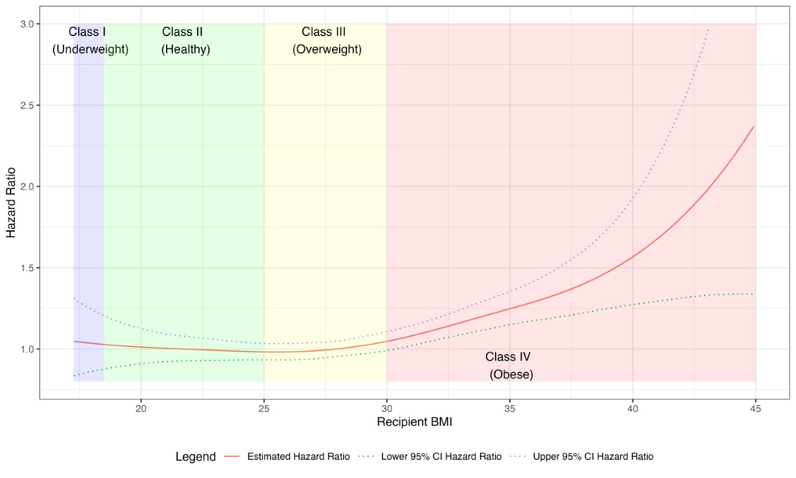

# Research

As a scientist, my broad portfolio focuses on two main areas: causal inference and machine learning.

## Causal Inference

My primary work uses novel statistical techniques to evaluate policies and treatments. I am especially interested in solving long-standing debates in science. A notable project undertaken by our team addressed a long-standing debate among transplant surgeons about the importance of matching patients based on biological sex for heart transplant recipients. Utilizing causal inference methods such as propensity score matching combined with equivalence testing, we demonstrated in the UNOS national transplant database that sex-matching does not confer any postoperative risk for multiple outcomes, including post-transplant mortality, stroke, dialysis, and acute rejection ([link](https://www.medrxiv.org/content/10.1101/2024.02.23.24303301v1)).

In addition to solving current disputes, I also believe in approaching problems from new angles. While traditional analyses often assume linear relationships, our team's work with nonlinear spline models has shown that many key aspects of transplantation, such as heart size and BMI, have clear nonlinear effects on post-transplant outcomes. This has an immense impact on decision-making for transplant surgeons, such as organ allocation prioritization and determining which donors are optimal matches for each patient. Our findings indicate that at a BMI of 30, heart transplant recipients experience a sharp increase in the risk of mortality with each additional BMI point ([link](<https://www.jhltonline.org/article/S1053-2498(24)00196-7/fulltext>)).

## Machine Learning

Another focus of mine is machine learning. I have contributed to work building a foundation model for diagnosing cardiac diseases on MRI ([link](https://arxiv.org/abs/2312.00357)) and automatically identifying heterogeneous subgroups with variation in survival in heart transplantation ([link](<https://www.jhltonline.org/article/S1053-2498(24)00203-1/fulltext>)).

# Data Science Tools

I am also passionate about creating codebases and dashboards to facilitate my work and help others. Stay tuned for upcoming posts where I will share these tools, along with their corresponding GitHub repositories, making them accessible to the broader community.

